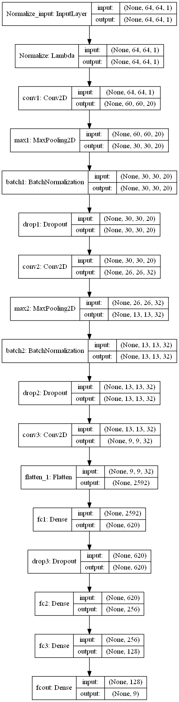
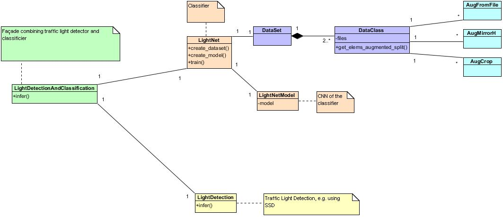

Traffic Light Detection Module
==

The traffic light detection could be done in several ways, but we decided to use a neural network as it seemed a modern and flexible approach.

Our pipeline is divided in two stages:
* Traffic Light detection, using a detector already trained on COCO
* Traffic light classification, using a custom Neural Network

Traffic Light boxes detection
==
For the Traffic Light Detection, we wanted to use a detector already trained. There are several in the Model Zoo of TensorFlow, able to hit several performance/precision points.
The goal is to find the traffic lights, so that we can feed them to the Neural Network for classification.

The most interesting seemed to be:
- SSD on Inception (very fast, many false negative)
- Faster RCNN trained on Inception (much slower, much more precise)
- Faster RCNN trained on ResNet 101 (the slowest, and the most precise)

At the moment of writing, we are oriented on choosing Faster RCNN trained on Inception.
To give an idea, SSD can be 5 times faster the Faster RCNN on Inception.

*Please note that the Faster RCNN trained on ResNet 101 is not included here, as GitHub refused to accept such a big file. It can be downloaded from the TensorFlow Model Zoo, and it should be renamed rcnn_res101_frozen_inference_graph.pb*

Traffic Light Classifier
===
I wanted the classifier to be very fast and relatively reliable. I started from LeNet, and I tuned the network to improve its precision to around 94%.
The network uses 3 convolutional layers and 4 fully connected layers, and accepts images of 64x64 pixels. The complete diagram is the following:

Attempts to use 4 layers seemd to show that the network was starting to overfit.

## Training the Neural Network

The Neural Network has been trained mainly using the Udacity dataset number 2. Unfortunately a relatively high amount of images were not classified correctly, so we had to manually clean the dataset.

To make the Neural Network better at recognizing traffic lights in the simulator, we added some images taken from the simulator.

During the tests, it became clear that the detector was recognizing also traffic lights oriented toward the other direction, so we added a class to classify that.
To reduce the false positives, we also added a class for traffic lights off and one for noise.

The training has been performed with **early stopping** and **checkoints** on validation loss.

**Adam** seemed to perform better than the other optimizers.

## Data Augmentation
To increase the precision, we used **data augmentation** (mirroring and cropping), through a generator.

Generators with Data Augmentation tend to become a bit complex. To solve the problem we implemented some classes to better structure the training data.
There is a **DataSet** composed by several objects of type **DataClass**. A DataClass contains a list of files and the label associated to them.
But DataClass is also able to augment a file, providing several versions generated by some "augmenters" (**AugFromFile**, **AugMirrorH**, **AugCrop**).

To simplify the logic, while reducing the memory consumption and improving the generalization, the generator follows some basic rules:
* The full list of Augmenters (e.g. original file, 2 cropping, 3 mirrors, for each sample) is always kept in RAM
* Augmenters get the image from another augmenter, so they don't need to keep it around
* The Augmenter that reads from the file, might be configured to cache, to speed up a bit the training
* Every epoch the Augmenters will be asked to provide their image, so the cropping will be different every time, improving generalization

DataSet and DataClasses have been put in the **LightNet** class, which known how the network needs to be trained, and just need to be given the directories with the images. The images are classified in directories, as it makes easier to find problems.

The following diagram shows the main classes defined in the project:

## Inference
While testing, it become obvious that Keras models saved on Python 3 were not compatible with Python 2. To solve the problem, and hopefully increase performance, we froze the graph and exported it. In this way, while the training has been perfomed with Keras, the inference is done purely with TensorFlow.

## Dealing with False Negatives
The network has been designed to detect only one traffic light, as this was the requirement for Udacity. However it might detect more than one and skip the false positives.
A problem is however the false negative, as detector might have problems to find the traffic lights, sometimes.
A way to solve this issue, is to assume that if there are no detections, the last detection is still valid, at least for a few frames.
